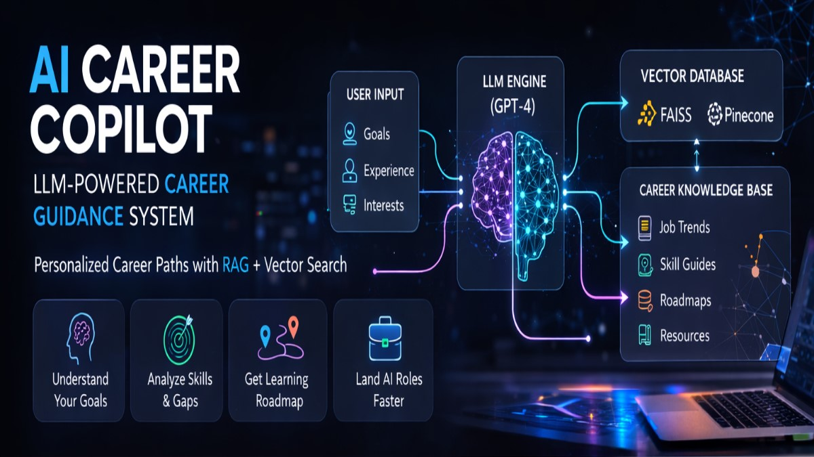
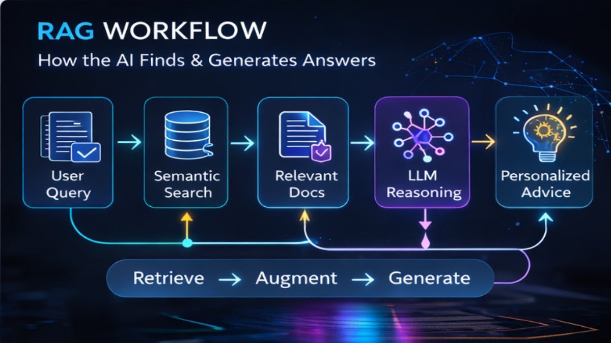
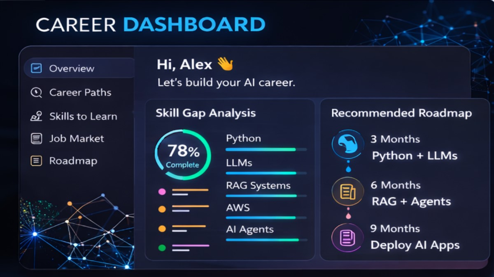
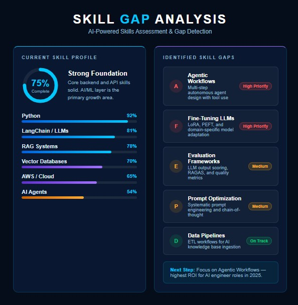
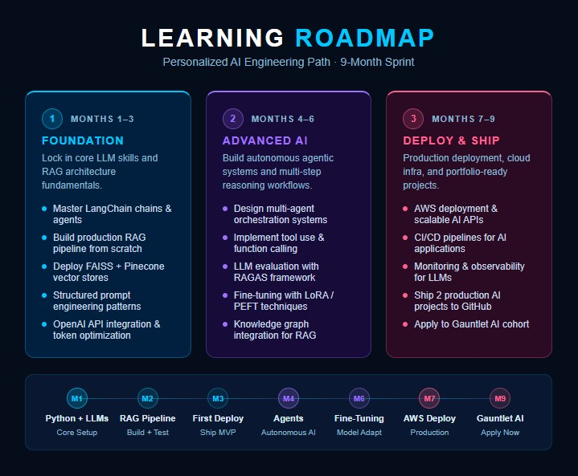

# AI Career Copilot

**LLM-powered career guidance using RAG + Vector Search**

Built to solve a real problem: most career advice is generic. This system actually knows your background, retrieves relevant context, and generates recommendations grounded in current job market realities — not hallucinated platitudes.

---

## What It Does

You give it your goals, experience, and skills. It analyzes the gap between where you are and where you're going, pulls relevant context from a curated knowledge base, and returns:

- A **skill gap analysis** ranked by ROI for your target role
- A **personalized learning roadmap** (not a generic one)
- **Career path recommendations** with honest tradeoffs
- **Resource suggestions** anchored to real job requirements

The difference from a generic chatbot: the LLM never answers from memory alone. Every response is grounded in retrieved documents — job postings, skill guides, role-specific roadmaps — so the advice is specific and current.

---

## Architecture



**Core flow:**
1. User inputs goals, experience level, and interests
2. Query is embedded and run through semantic search against the vector store
3. Relevant documents (job trends, skill guides, roadmaps) are retrieved
4. GPT-4 reasons over the retrieved context + user profile
5. Personalized advice is returned — grounded, not guessed

---

## RAG Workflow



The pipeline follows standard RAG architecture: **Retrieve → Augment → Generate**. I used FAISS for local development and Pinecone for the hosted vector store. LangChain handles the chain orchestration and prompt templating.

---

## Dashboard



Streamlit frontend showing:
- Overall skill completion score
- Per-skill progress bars
- Recommended learning roadmap with time estimates
- Sidebar navigation (Career Paths, Skills to Learn, Job Market, Roadmap)

---

## Skill Gap Analysis



The system scores your current profile against target role requirements and surfaces gaps by priority. High-priority gaps (Agentic Workflows, Fine-Tuning LLMs) are flagged separately from medium-priority and on-track items. The "Next Step" recommendation is generated, not hardcoded.

---

## Learning Roadmap



9-month sprint broken into three phases:
- **Months 1–3**: Foundation — LangChain, RAG pipeline, FAISS + Pinecone, prompt engineering
- **Months 4–6**: Advanced AI — multi-agent systems, fine-tuning with LoRA/PEFT, RAGAS evaluation
- **Months 7–9**: Deploy & Ship — AWS deployment, CI/CD for AI apps, LLM monitoring, 2 production projects

---

## Tech Stack

| Layer | Tools |
|---|---|
| LLM | GPT-4 via OpenAI API |
| Orchestration | LangChain |
| Vector Store | FAISS (local) / Pinecone (hosted) |
| Embeddings | OpenAI `text-embedding-ada-002` |
| Frontend | Streamlit |
| Language | Python 3.10+ |

---

## Setup

```bash
git clone https://github.com/yourusername/ai-career-copilot
cd ai-career-copilot
pip install -r requirements.txt
```

Create a `.env` file:

```
OPENAI_API_KEY=your_key_here
PINECONE_API_KEY=your_key_here
PINECONE_ENV=your_env_here
```

Run the app:

```bash
streamlit run app.py
```

---

## Project Structure

```
ai-career-copilot/
├── app.py                  # Streamlit entry point
├── rag/
│   ├── retriever.py        # Vector search + document retrieval
│   ├── chain.py            # LangChain RAG chain
│   └── prompts.py          # Prompt templates
├── data/
│   ├── ingest.py           # Knowledge base ingestion pipeline
│   └── knowledge_base/     # Curated career docs (job trends, skill guides)
├── utils/
│   └── skill_analyzer.py   # Skill gap scoring logic
├── assets/                 # Project screenshots
├── requirements.txt
└── .env.example
```

---

## Why I Built This

Career advice online is either too generic ("learn Python!") or too specific to be useful to anyone else. I wanted to build something that actually personalizes — using the same RAG patterns that power real production AI systems — and applies them to a domain where the quality gap between generic and grounded advice is obvious and measurable.

It's also a useful testbed for RAG architecture decisions: chunking strategies, retrieval quality, prompt design for structured outputs, and evaluation with RAGAS.

---

## Skills Demonstrated

`Python` · `OpenAI API` · `LangChain` · `RAG` · `Vector Databases` · `Streamlit` · `Prompt Engineering` · `FAISS` · `Pinecone`
